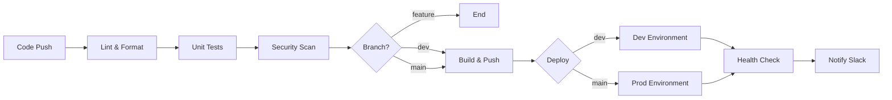

# 🎯 CI/CD Pipeline - Quick Reference

## 📦 Services Overview

| Service | Tech Stack | Workflow File | Status |
|---------|-----------|---------------|--------|
| 🔐 **Auth Service** | Java 17 + Spring Boot | `auth-service-ci-cd.yml` | ✅ Ready |
| 📝 **Quiz Service** | Golang 1.21 | `quiz-service-ci-cd.yml` | ✅ Ready |
| 📊 **Submission Service** | Java 17 + Spring Boot | `submission-service-ci-cd.yml` | ✅ Ready |
| 📈 **Analytics Service** | Python 3.11 + FastAPI | `analytics-service-ci-cd.yml` | ✅ Ready |
| 📧 **Notification Service** | Golang 1.21 | `notification-service-ci-cd.yml` | ✅ Ready |

## 🔄 Pipeline Stages



## ⚡ Quick Commands

### Local Testing
```bash
# Test Python service
cd analytics-service && pytest

# Test Java service
cd auth-service && mvn test

# Test Go service
cd quiz-service && go test ./...
```

### Manual Workflow Trigger
```bash
# Via GitHub CLI
gh workflow run analytics-service-ci-cd.yml -f branch=dev

# Via UI
GitHub → Actions → Select Workflow → Run workflow
```

### Check Workflow Status
```bash
# List workflow runs
gh run list

# View specific run
gh run view <run-id>

# Watch run
gh run watch
```

## 📋 Checklist Before First Deployment

```markdown
### GitHub Configuration
- [ ] Add DEV_HOST, DEV_USERNAME, DEV_SSH_KEY
- [ ] Add PROD_HOST, PROD_USERNAME, PROD_SSH_KEY
- [ ] Add SLACK_WEBHOOK (optional)
- [ ] Add SONAR_TOKEN (for Java services)

### Server Setup
- [ ] Docker installed on servers
- [ ] docker-compose installed
- [ ] SSH keys configured
- [ ] Firewall rules configured
- [ ] Health check endpoints working

### Code Setup
- [ ] All services have Dockerfile
- [ ] All services have docker-compose.yml
- [ ] Tests passing locally
- [ ] Environment variables configured

### First Deployment
- [ ] Test on dev branch first
- [ ] Monitor logs
- [ ] Verify health checks
- [ ] Test main branch
```

## 🎨 Workflow Visualization

### Analytics Service (Python)
```
Push → Lint (flake8/black) → Test (pytest) → Security (bandit)
  → Build Docker → Push ghcr.io → Deploy → Health Check → Notify
```

### Auth/Submission Service (Java)
```
Push → Compile (Maven) → Lint (Checkstyle/PMD) → Test (JUnit)
  → Security (OWASP) → SonarQube → Build JAR → Docker
  → Push ghcr.io → Deploy → Health Check → Notify
```

### Quiz/Notification Service (Go)
```
Push → Format (gofmt) → Lint (golangci-lint) → Test (go test)
  → Security (gosec) → Build Binary → Docker → Push ghcr.io
  → Deploy → Health Check → Notify
```

## 🔔 Notification Examples

### Slack Notification Format
```json
{
  "text": "✅ Analytics Service deployed to production",
  "attachments": [{
    "color": "good",
    "fields": [
      {"title": "Branch", "value": "main", "short": true},
      {"title": "Commit", "value": "abc1234", "short": true},
      {"title": "By", "value": "developer", "short": true},
      {"title": "Status", "value": "Success", "short": true}
    ]
  }]
}
```

## 📊 Expected Build Times

| Service | Lint | Test | Build | Deploy | Total |
|---------|------|------|-------|--------|-------|
| Analytics | ~1m | ~2m | ~3m | ~1m | **~7m** |
| Auth | ~2m | ~3m | ~4m | ~1m | **~10m** |
| Quiz | ~1m | ~2m | ~2m | ~1m | **~6m** |
| Submission | ~2m | ~3m | ~4m | ~1m | **~10m** |
| Notification | ~1m | ~2m | ~2m | ~1m | **~6m** |

## 🐛 Common Issues & Solutions

### Issue 1: Workflow not triggering
```yaml
Solution: Check paths in workflow file
paths:
  - 'service-name/**'  # Must match your directory structure
```

### Issue 2: Docker build fails
```bash
Solution: Check Dockerfile and dependencies
docker build -t test .  # Test locally first
```

### Issue 3: SSH connection failed
```bash
Solution: Verify SSH key and server access
ssh -i key user@host  # Test connection
```

### Issue 4: Tests failing
```bash
Solution: Run tests locally first
cd service-dir && run-tests
```

## 🎓 Learning Resources

### GitHub Actions
- [Official Docs](https://docs.github.com/en/actions)
- [Actions Marketplace](https://github.com/marketplace?type=actions)
- [Workflow Syntax](https://docs.github.com/en/actions/reference/workflow-syntax-for-github-actions)

### Docker
- [Best Practices](https://docs.docker.com/develop/dev-best-practices/)
- [Multi-stage Builds](https://docs.docker.com/build/building/multi-stage/)

### CI/CD Best Practices
- [Continuous Integration](https://martinfowler.com/articles/continuousIntegration.html)
- [Deployment Strategies](https://martinfowler.com/bliki/BlueGreenDeployment.html)

## 📞 Getting Help

1. **Read Documentation**: Start with CI-CD-README.md
2. **Check Logs**: GitHub Actions → Select run → View logs
3. **Local Testing**: Use `act` to test workflows locally
4. **Create Issue**: GitHub Issues for bugs/questions
5. **Slack**: #ci-cd-support channel

## 🚀 Deployment URLs

### Development
- Auth: https://dev-auth.your-domain.com
- Quiz: https://dev-quiz.your-domain.com
- Submission: https://dev-submission.your-domain.com
- Analytics: https://dev-analytics.your-domain.com
- Notification: https://dev-notification.your-domain.com

### Production
- Auth: https://auth.your-domain.com
- Quiz: https://quiz.your-domain.com
- Submission: https://submission.your-domain.com
- Analytics: https://analytics.your-domain.com
- Notification: https://notification.your-domain.com

---

**🎉 Happy Deploying! 🎉**

*Last updated: 2025-11-29*


