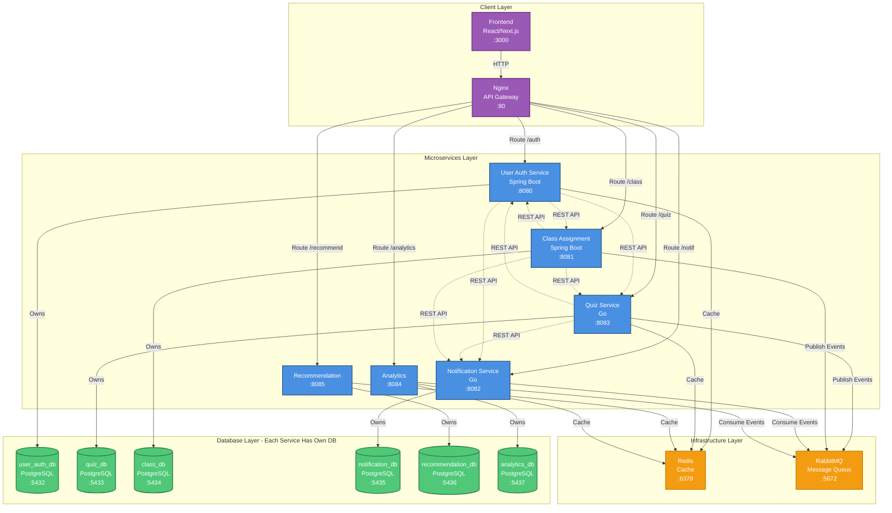

# Architecture Diagram - Database per Service

## Legend

### 🔵 Microservices (Blue)
- Each service is independently deployable
- Own codebase and technology stack
- Communicates via REST APIs

### 🟢 Databases (Green)
- Each service has its own database
- **NO** cross-database queries
- **NO** foreign keys between services
- Independent scaling and backup

### 🟠 Infrastructure (Orange)
- **Redis**: Shared caching layer
- **RabbitMQ**: Asynchronous messaging

### 🟣 Client Layer (Purple)
- **Frontend**: User interface
- **Nginx**: API Gateway & reverse proxy

## Communication Patterns

### Solid Lines (→)
- Direct ownership
- Service → Database connection

### Dashed Lines (⤏)
- REST API calls between services
- Event publishing/consuming
- Caching

## Key Principles

### ✅ Database per Service
Each microservice owns its database completely:
- `user-auth-service` → `user_auth_db`
- `quiz-service` → `quiz_db`
- `class-assignment-service` → `class_db`
- `notification-service` → `notification_db`
- `recommendation-service` → `recommendation_db`
- `analytics-service` → `analytics_db`

### ✅ Loose Coupling
Services communicate via:
1. **Synchronous**: REST API calls
2. **Asynchronous**: RabbitMQ events
3. **Caching**: Redis for performance

### ✅ Data Consistency
- **SAGA Pattern**: Distributed transactions
- **Event Sourcing**: Audit trail
- **Eventual Consistency**: Via events

## Benefits

### Scalability
- Scale databases independently
- Scale services independently
- Different DB engines possible

### Resilience
- Fault isolation
- No single point of failure
- Independent deployment

### Development
- Team autonomy
- Technology flexibility
- Parallel development

### Security
- Database isolation
- Separate credentials
- Better access control
